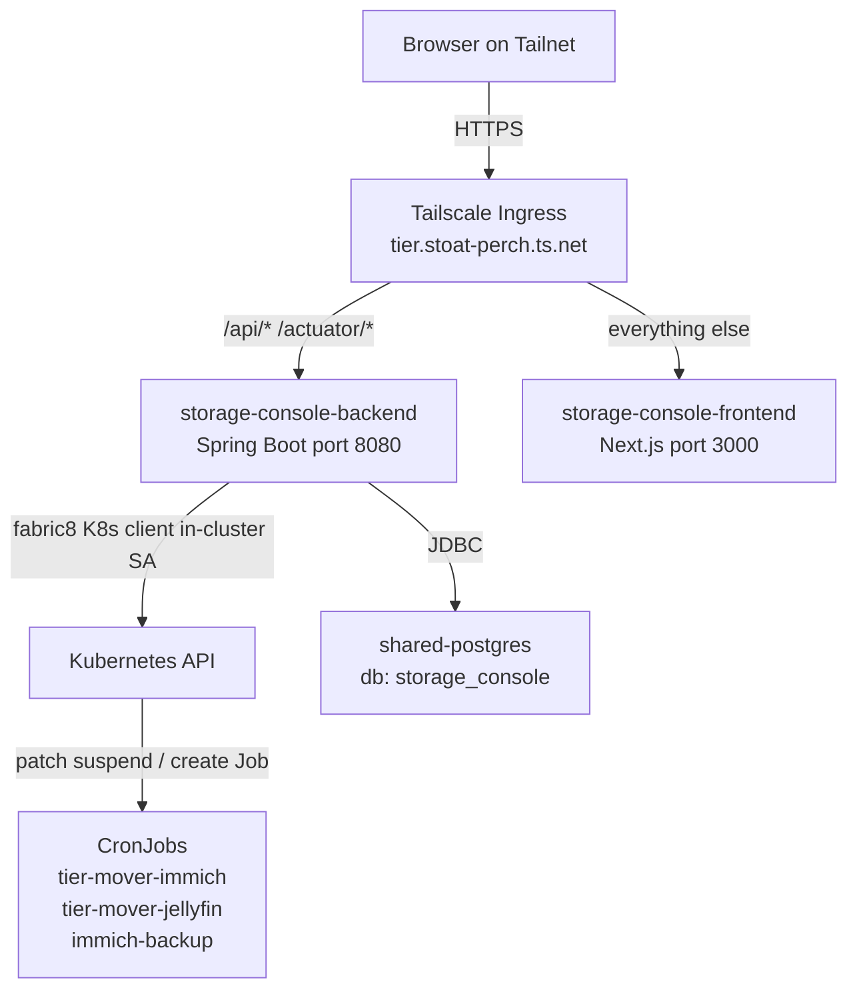

# Architecture

**On this page:** [Deployment diagram](#deployment-diagram) · [Overview](#overview) · [Tech stack](#tech-stack) · [REST API](#rest-api) · [Data model](#data-model) · [Mode persistence](#mode-persistence) · [HDD-connected detection](#hdd-connected-detection) · [CronJob HDD guard](#cronjob-hdd-guard) · [Why fabric8 over kubectl?](#why-fabric8-over-kubectl) · [Container images](#container-images) · [Ingress](#ingress) · [Security posture](#security-posture) · [v1 → v2 changes](#v1--v2-changes)

## Deployment diagram



## Overview

storage-console v2 is a two-container app (Spring Boot backend + Next.js frontend) that wraps three Kubernetes CronJobs in a friendly UI. The CronJobs themselves are also owned by this app (defined in `k8s/40-cronjobs.yaml`).

```
┌──────────────────────────────────────────────────────────────────┐
│                     Browser (Tailnet)                            │
│                          │                                       │
│                          │  HTTPS                                │
│                          ▼                                       │
│              tier.stoat-perch.ts.net                             │
│                          │                                       │
│                          │  Tailscale Ingress (host:tier)        │
│                          ▼                                       │
│   ┌──────────────────────┴──────────────────────┐                │
│   │ /api/*, /actuator/* │ everything else       │                │
│   ▼                                  ▼                           │
│  storage-console-backend       storage-console-frontend          │
│  (Spring Boot)                 (Next.js standalone)              │
│   :8080                         :3000                            │
│       │                                                          │
│       │ fabric8 K8s client (in-cluster SA)                       │
│       ▼                                                          │
│  ┌─────────────────────────────────────────────────────────┐     │
│  │  CronJobs (homelab namespace)                           │     │
│  │   tier-mover-immich     tier-mover-jellyfin             │     │
│  │   immich-backup                                         │     │
│  │   ─ each spawns a Job, each Job spawns a Pod            │     │
│  └─────────────────────────────────────────────────────────┘     │
│       │                                                          │
│       │ JDBC                                                     │
│       ▼                                                          │
│   shared-postgres (db: storage_console)                          │
│      audit_event, task_run, app_user                             │
└──────────────────────────────────────────────────────────────────┘
```

## Tech stack

| Layer | Tech |
|---|---|
| Backend | Java 21, Spring Boot 3.4 |
| Auth | Spring Security + JWT (jjwt 0.12), BCrypt for admin password |
| Persistence | Spring Data JPA, Hibernate, Flyway, PostgreSQL 17 |
| K8s client | fabric8 `io.fabric8:kubernetes-client` 6.13 |
| Frontend | Next.js 15 (App Router), React 19, TypeScript, Tailwind 3 |
| Build | Maven (multi-stage Dockerfile, Temurin 21 JRE), npm + Next standalone output |
| Deploy | OrbStack k3s, `imagePullPolicy: Never`, envsubst-templated manifests |
| Ingress | Tailscale ingress controller |

## REST API

All routes under `/api/`. JWT in `Authorization: Bearer <token>` (or as the only auth-aware cookie via the frontend's `localStorage` flow).

| Method | Path | Purpose |
|---|---|---|
| POST | `/api/auth/login` | `{username, password}` → `{token, expiresInSeconds, user}` |
| GET | `/api/auth/me` | current user info |
| GET | `/api/tasks` | list of three tasks with mode, schedule, last run, HDD status |
| GET | `/api/tasks/{id}` | single task view |
| PUT | `/api/tasks/{id}/mode` | body `{mode: "auto"\|"manual"}` → toggles CronJob suspend |
| POST | `/api/tasks/{id}/trigger` | manual run; rejects 409 if mode=auto |
| GET | `/api/tasks/{id}/runs?limit=10` | recent Jobs spawned by this CronJob |
| GET | `/api/tasks/{id}/runs/{jobName}/logs?lines=500` | text/plain log tail |
| GET | `/api/system/hdd-status` | `{hostPath, connected, lastChecked}` (cached 30s) |
| GET | `/actuator/health/{liveness,readiness}` | k8s probes |

## Data model

```sql
app_user      (id, username, password_hash, display_name, role, created_at)
task_run      (id, task_id, job_name, trigger_kind, triggered_by,
                 started_at, finished_at, outcome, exit_code, log_excerpt)
audit_event   (id, at, actor, action, target, detail)
```

The `task_run` table is forward-looking — currently the live "last run" comes directly from the Kubernetes Job API. `audit_event` is populated on mode toggles and manual triggers.

## Mode persistence

Mode (Auto vs Manual) is **not** stored in the database. It's stored as `CronJob.spec.suspend` in Kubernetes — single source of truth, no sync problems.

- `mode=auto` ⇒ `spec.suspend=false` ⇒ CronJob fires at the schedule
- `mode=manual` ⇒ `spec.suspend=true` ⇒ CronJob never fires; only `kubectl create job --from=cronjob/<n>` triggers a run

Backend toggles this via `kubernetesClient.batch().v1().cronjobs().withName(n).edit(...)` (fabric8).

## HDD-connected detection

The backend pod's Deployment mounts the macOS host path `HOMELAB_TIER_HDD_PATH` (default `/Volumes/homelab-hdd`) as `hostPath` at `/hdd-probe`. The `HddProbeService`:

1. Checks `Files.isDirectory(/hdd-probe)`.
2. Lists the directory — at least one entry means "mounted" (a freshly-unplugged disk leaves an empty mount point on macOS auto-mount).
3. Caches the result for 30 s to keep the UI poll cheap.

This is preferred over spawning a probe Job because it's instant (~µs) and doesn't pollute the Jobs history.

## CronJob HDD guard

Every CronJob's main container starts with:

```sh
if [ ! -d /hdd-check ] || [ -z "$(ls -A /hdd-check 2>/dev/null)" ]; then
  echo "SKIP HDD not mounted — exiting 0."
  exit 0
fi
```

`/hdd-check` is a read-only `hostPath` mount of `HOMELAB_TIER_HDD_PATH`. If the disk isn't mounted on the Mac, the directory is empty and the job exits 0 silently — no false failures clogging `failedJobsHistoryLimit`.

## Why fabric8 over kubectl?

The v1 Go app shelled out to `kubectl` for everything. v2 uses fabric8's Java client because:

- Strongly typed CronJob/Job objects (no JSON parsing in app code).
- Native `edit(...)` builder for patching `spec.suspend` (no JSON-Patch escaping).
- Uses the pod's ServiceAccount token automatically — no kubectl binary needed in the image.
- Container image is smaller (Temurin JRE only, no `apk add kubectl`).

## Container images

| Image | Base | Size estimate |
|---|---|---|
| `storage-console-backend` | `eclipse-temurin:21-jre` | ~330 MB |
| `storage-console-frontend` | `node:22-alpine` + Next standalone | ~200 MB |

Both built locally for `linux/arm64` and consumed by OrbStack k3s with `imagePullPolicy: Never`.

## Ingress

Single Tailscale Ingress at `host: tier`. Path-routes:

- `/api/*` and `/actuator/*` → backend Service `:8080`
- everything else → frontend Service `:3000`

The frontend's `next.config.js` also proxies `/api` and `/actuator` to the backend when running locally via `kubectl port-forward svc/storage-console-frontend 3000:3000`.

## Security posture

- Tailscale ACLs gate the Tailnet ingress.
- Spring Security adds an admin login layer on top — useful when phones with Tailscale roam onto untrusted networks.
- Single admin user (no role hierarchy). Bootstrap via env, then rotate the password (see MAINTENANCE.md).
- RBAC is namespace-scoped — the SA cannot escape to other namespaces.
- All log endpoints are text/plain pass-throughs; the frontend renders them inside a `<pre>` with no HTML interpretation.

## v1 → v2 changes

| | v1 (Go) | v2 (Spring Boot + Next.js) |
|---|---|---|
| Backend | Go stdlib + `os/exec kubectl` | Spring Boot + fabric8 Java client |
| Frontend | Vanilla HTML/CSS/JS in `embed.FS` | Next.js 15 App Router + Tailwind |
| Mode toggle | n/a (always suspend=true) | Auto/Manual stored as `spec.suspend` |
| HDD detection | n/a | hostPath probe with 30s cache |
| Auth | None (Tailscale only) | Tailscale + JWT admin login |
| Database | None | shared-postgres (audit + future run history) |
| CronJob ownership | cluster-setup + ~/homelab | storage-console k8s manifests |
| Code lines | ~800 | ~1800 |
